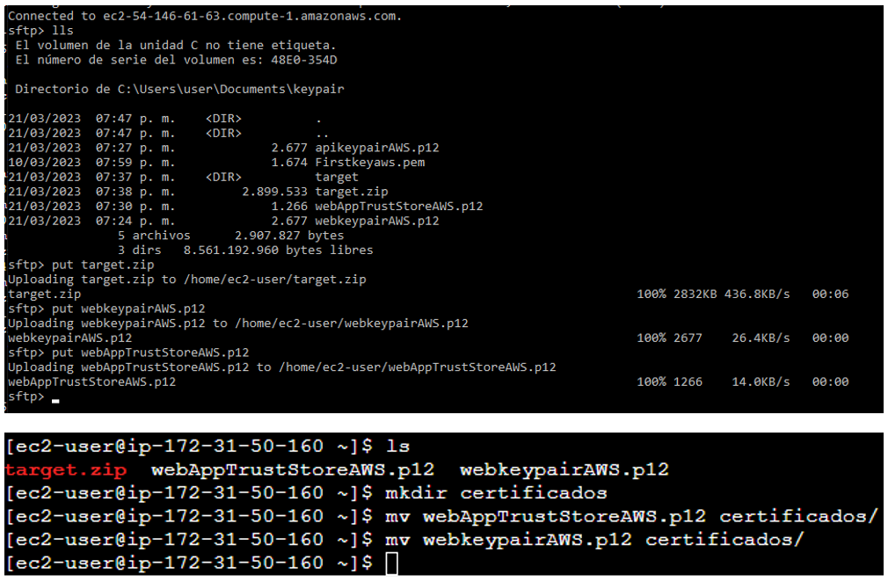

# **APLICACIÓN DISTRIBUIDA SEGURA EN TODOS SUS FRENTES**

Aplicación desplegada en AWS usando varias instancias EC2. La aplicación cuenta con un servidor web el cual implementa HTTPS para su conexión con el browser, a su vez, este se conecta con una API REST que únicamente devuelve "Hello from Remote Server". Esta última conexión también se realiza mediante https. Se implementó un sistema de login para asegurar integridad, autorización y autenticación. La aplicación respoeta la siguiente arquitectura.


## Getting Started

These instructions will get you a copy of the project up and running on your local machine for development and testing purposes.

### Prerequisites

What things you need to install the software and how to install them
Para hacer uso de la aplicación necesitarás tener instalado el siguiente software
- [JDK](https://docs.aws.amazon.com/es_es/corretto/latest/corretto-8-ug/amazon-linux-install.html) version 1.8.x
- [Maven](https://maven.apache.org/download.cgi)
- [Git](https://git-scm.com/downloads)
- [MongoDB](https://docs.aws.amazon.com/dms/latest/sbs/chap-mongodb2documentdb.02.html)


### Installing

Para obtener una copia de la aplicación deberás clonar este repositorio. Ingresa la siguiente instrucción en Git Bash:

```
git clone https://github.com/Andresariz88/AREP-Taller07
```

Luego, ejecuta el siguiente comando para compilar y empaquetar todo el proyecto:

```
mvn package
```


## **Diseño**
### WebApp
El servidor web está creado con el microframework web [Spark](https://sparkjava.com/). La instrucción GET para la ruta "/" hace la conexión con el servidor remoto. Para esto, el servidor tiene implementada la opción de seguridad en la que tiene su certificado en el KeyStore y al hacer la conexión HTTPS cambia el contexto SSL haciento que el TrustStore contenga el certificado del servidor con el que se quiera hacer la conexión, en este caso "RemoteServer".

### RemoteServer
Los servidor remoto también está creado con [Spark](https://sparkjava.com/).Este está configurado para funcionar únicamente con conexiones HTTPS y retorna la cadena "Hello from Remote Server".


## **Implementación**
Todas las instacias EC2 deberán tener [JDK](https://docs.aws.amazon.com/es_es/corretto/latest/corretto-8-ug/amazon-linux-install.html) version 1.8.x para Amazon Linux instalado.

Creamos los certificados para cada servidor indicando el nombre y apellido como la dirección de DNS pública.


Exportamos el certificado del servidor remoto (apikeypairAWS) para importarlo en el TrustStore del servidor web.


Lo importamos.


En este punto ya tenemos los KeyStore y TrustStore necesarios para realizar las conexiones correctas y de manera segura. Vamos a llevarlos a cada servidor.

Para el RemoteServer. Únicamente es necesario el KeyStore con el certificado propio.


Y para WebApp, aquí movemos tanto el KeyStore como el TrustStore que contiene el certificado de RemoteServer.



Enviamos los programas con SFTP a los servidores y los corremos con ```java -cp``` y listo.

## **Prueba de seguridad**

La prueba de conexiones HTTPS se encuentra en el siguiente [video](https://drive.google.com/file/d/14F5_osgBJiuuqkH9FLmufNQS-vbcga8F/view?usp=share_link).

## **Implementación login**

Se implementó una estructura de datos en el servidor web la cual almacena usuarios y contraseñas encriptadas con MD5. De esta manera, el usuario deberá autentificarse cada por medio de la ruta "login.html".


El programa revisa que el usuario se encuentre en la base y encripta la contraseña dada para compararla con la guardada. En caso de que el usuario y contraseña sean correctos automáticamente se le redirige a "/" haciendo que se establezca la conexión con RemoteServer y se retorne el mensaje.

Por último se restringe el acceso a cualquier recurso si el usuario no está autenticado.


## Built With

* [Dropwizard](http://www.dropwizard.io/1.0.2/docs/) - The web framework used
* [Maven](https://maven.apache.org/) - Dependency Management
* [ROME](https://rometools.github.io/rome/) - Used to generate RSS Feeds

## Authors

* **Andrés Ariza** - *Initial work* - [Andresariz88](https://github.com/Andresariz88)


